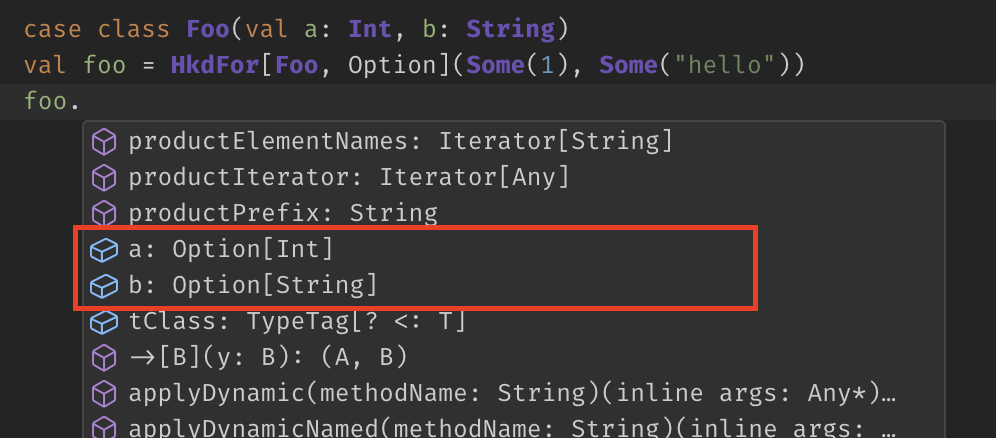

# hkd4s: Higher Kinded Data in Scala 3

hkd4s is a Scala 3 library that provides basic functions and typeclasses for working with higher kinded data. Higher kinded data is an idiom, most commonly known among Haskell library authors, where a data type is declared with a higher kinded type parameter `F[_]` and every field of the type is wrapped in `F[_]`:

```scala
case class User(name: String, age: Int)
case class UserOf[F[_]](name: F[String], age: F[Int])

case class Config(host: String, port: Int, maxConnections: Int)
case class ConfigOf[F[_]](host: F[String], port: F[Int], maxConnections: F[Int])
```

The hkd4s library provides generically derived typeclasses for working with higher kinded data types and can even __automatically generate__ those types for case classes.

## Applications of higher kinded data

The higher kinded data pattern allows us to abstract over the basic structure of the data type and declare many different versions of it without boilerplate. For example:

- `ConfigOf[Option]` could be the result of parsing a config file where only some of the configuration options are overwritten:
  
  ```yaml
  config:
    - host: 127.0.0.1
    - port: 44
  ```
  
  parsed into

  ```scala
  ConfigOf[Option](
    host = Some("127.0.0.1"),
    port = Some(44),
    maxConnections = None)
  ```
- `ConfigOf[List]` would then be the result of combining several sources of config options (config file, environment variables, defaults). 
- `UserOf[Seq]` could be a data frame of users that is stored in a columnar format:

   ```scala
   val usersDataFrame = UserOf[Seq](
    name = Seq("Albert", "Benedict", "Christopher", "Diane"), 
    age = Seq(59, 42, 22, 36))
  
  val meanAge = mean(usersDataFrame.age)
  ```
- `UserOf[Validated]` could be the result of validating each form field in a sign-up form
- When you want to send back error messages of the validated `User` form, each error message is a `String` regardless of what the field type was. `UserOf[Const[String, _]]` turns every field into a `String`:
  
  ```scala
  type FormError[A] = Const[String, A]
  val formErrors = UserOf[FormError](
    name = Const("name must not be empty"), 
    age = Const("age must be between 0 and 99"))
  ```
- `ConfigOf[Const[String, _]]` could also be documentation for the `Config` class: a doc string for every field:
  ```scala
  type DocString[A] = Const[String, _]
  val configDoc = ConfigOf[DocString](
    host = Const("host name of the server"), 
    port = Const("the server will listen on this port for new connections"),
    maxConnections = Const("maximum simultaneous connections"))
  ```
- `UserOf[Id]` is a plain `User` since `type Id[X] = X`

Higher kinded data appears in many places, if you know to look for it.

## Higher Kinded Data as Metadata

Higher kinded data types, especially those with a `Const[X, _]` argument, can be used to hold well-typed metadata about an object's fields. In the `ConfigOf[DocString]` example above, the higher kinded data instance holds not config values, but descriptive information about every config field. Higher kinded data classes can thus be useful in any place where we need metadata at runtime; usually this sort of metadata is supplied by field annotations in JVM languages:

```scala
case class Address(street: String, 
                   @JsValidatePositive()
                   houseNumber: Int, 
                   @JsName("zip_code")
                   zipCode: String)
```

The point of those annotations is to overwrite default behaviour, so we can do the same thing by... overwriting fields in a record of default behaviours:

```scala
val defaultJsReaders: AddressOf[JsReads] = defaultJsReaders[Address]

given JsReads[Address] = readsFromRecord(
  defaultJsReaders.copy(
     houseNumber = defaultJsReaders.houseNumber.map { (x: Int) =>
       require(x > 0)
       x
     }
    zipCode = defaultJsReaders.zipCode.rename("zip_code")
  ))
```

The advantage here is that we do not need to control the declaration of `Address` to be able to put annotations on the fields. Furthermore, we are much more flexible in the kind of changes that we can make. We no longer need a pre-defined `JsValidatePositive` annotation class. Any kind of validation imaginable can be done easily.

## Typeclasses

The real power of higher-kinded data comes from generic functions that can apply logic to any arbitrary higher-kinded data type instead of laboriously writing out the same code for each field. A basic suite of typeclasses is provided with the hkd4s library to easily and generically manipulate higher-kinded data types. All of these typeclasses should be familiar to functional programmers (`Functor`, `Pure`, `Apply`/`Applicative`, `Traverse`, etc.), except that they're at a higher kind and work on the wrapper type `F[_]` instead of the field types. A few of the most important typeclasses will be shown below:

### FunctorK

`FunctorK[D[_[_]]]` allows us to map the wrapper type from `F[_]` to `G[_]`. 

```scala
trait FunctorK[D[_[_]]] extends InvariantK[D]:
  extension [F[_]](df: D[F])
    def mapK[G[_]](fg: [A] => F[A] => G[A]): D[G]
```

Note that `mapK` is a higher-rank function where `fg` must work with *any possible*  `A`.

`FuntorK` can be used when we want to execute a generic operation on the wrapper type. For example, let's say that we have a `ConfigOf[List]` object containing a list of prioritized values for every config option that come from different sources (default, read from file, read from environment variable, etc.). To get the final `Config`, we must first take the highest priority value of each list (if there is one):

```scala
val prioritizedConfigValues: ConfigOf[List] = ???
val highestPrioConfigValue: ConfigOf[Option] = FunctorK[ConfigOf].mapK(prioritizedConfigValues)(
        [A] => (a: List[A]) => a.headOption // the head has the highest priority
)
```

Furthermore, `FunctorK` can also `mapK` with implicit given instances for each field:

```scala
val user = UserOf[Id](name = "Alice", age = 32)
val userFieldStrings: UserOf[Const[String, _]] = FunctorK[UserOf].mapKGiven(user)[Show](
  [A] => (field: A) => (showInst: Show[A]) ?=> 
        Const[String, A](summon[Show[A]].show(field))
)
```

In contrast to the `zipK`/`map2K` functions of the type class `ApplyK`, this `mapKGiven` function will also work with coproduct types.

### PureK

`PureK[D[_[_]]]` is a typeclass that allows us to create instances of `D[F]` from nothing.

```scala
trait PureK[D[_[_]]]:
  def pureK[F[_]](gen: [A] => () => F[A]): D[F]
```

Again, `pureK` is a higher-rank function where `gen` must work for any arbitrary field type `A`. Since we do not know `A` in advance and it is impossible to write a sensible function `def absurd[T]: T` that would create a value of arbitrary type, the ability to create an "empty" value must come from `F[_]`. Thus, `PureK` is often most useful when `F[_]` is sort of monoidal:

```scala
val x: UserOf[List] = PureK[UserOf].pureK([A] => () => List.empty[A])
```

### ApplyK

```ApplyK[D[_[_]]]``` primarily offers the ability to zip two higher-kinded data types together. 

```scala
trait ApplyK[D[_[_]]] extends FunctorK[D]:
  extension [F[_]](df: D[F]) {
    def zipK[G[_]](dg: D[G]): D[[A] =>> (F[A], G[A])]
    def map2K[G[_], H[_]](dg: D[G])(h: [A] => (F[A], G[A]) => H[A]): D[H]
  }
````

Example:

```scala
val person1 = UserOf[Id](name = "Alice", age = 32)
val person1 = UserOf[Id](name = "Bob", age = 35)
val couple: UserOf[[A] =>> (A, A)] = ApplyK[UserOf].zipK(person1)(person2)
```

We can also use `ApplyK` to map a function of multiple parameters directly over multiple higher-kinded data objects:

```scala
def foo[A](l: A, r: A): A = ???
ApplyK[UserOf].map2K(l)(r)(foo)
```

Since two objects must be guaranteed to have exactly the same fields to be zipped together, `ApplyK` can only be derived for product types.

### TraverseK

`TraverseK[D[_[_]]]` is surely one of the most important typeclasses, as it allows us to turn the composition of wrapper types "inside out", floating `F[_]` outside of the higher-kinded data type `D`:

```scala
trait TraverseK[D[_[_]]] extends FunctorK[D] {
  extension [F[+_], G[_]](dfg: D[[A] =>> F[G[A]]])
    def sequenceK(using Applicative[F]): F[D[G]]
```

Consider the config example from before. We have combined all our different config sources `ConfigOf[List]` into a single `ConfigOf[Option]` using `FunctorK.mapK`, but at some point, we want to have the real `Config` (i.e. `ConfigOf[Id]`) with every field defined to a _single_ value, not more, not less. `FunctorK` can not do this, but `TraverseK` can:

```scala
val highestPrioConfigValue: ConfigOf[Option] = ???
val finalConfig: Option[ConfigOf[Id]] = TraverseK[ConfigOf].sequenceK[Option, Id](highestPrioConfigValue) 
```

Obviously, the result can only be `Option[Config]` (`=:= Option[ConfigOf[Id]]`) because fields in `ConfigOf[Option]` may be `None` and it would be impossible then to assemble a `Config` if a field is missing.

## Automatic type generation for case classes

hkd4s contains sophisticated mechanisms for generating higher kinded data types of case classes automatically. All you have to do is reference the type `HkdFor` and everything will work:

```scala
case class User(name: String, age: Int)
val partialUser: HkdFor[User, Option] = HkdFor[User, Option](name = Some("hello"), age = None)
println(partialUser.name)
```

Automatic higher kinded data types can be generated for algebraic data types (case classes and sealed traits) of any depth. Recursive types are currently unsupported. They have `apply` functions/constructors and `copy` methods with named and/or unnamed arguments and even work  with generic typeclass derivation in third-party libraries using Shapeless or `scala.deriving.Mirror`. 

When using VSCode with Metals we even get code completion for fields:



For convenience, a type alias `HkdFor_[T] = [F[_]] =>> HkdFor[T, F]` is provided to allow easy partial application:

```scala
FunctorK[HkdFor_[Foo]] == FunctorK[HkdFor[Foo, _]]
```

Generated higher kinded data types can be destructured and pattern matched on the first type parameter safely (except for wildcard types):

```scala
sealed trait Foo
case class Foo1(a: Int) extends Foo
case class Foo2(b: String) extends Foo

val foo: HkdFor[Foo, Option] = HkdFor[Foo2, Option]("hello")
foo match
  case HkdFor[Foo1, Option](a) => a: Int
  case HkdFor[Foo2, Option](b) => b: String
```

*(Note: IntelliJ is currently unable to highlight pattern matches with type parameters and will show errors, but they work)*

When matching a single case on a `HkdFor[T, F]` with known `T` and known `F`, the type arguments on the case definition can be omitted:

```scala
(partialUser: HkdFor[User, Option]) match
  case HkdFor(name, age) => println(name + " " + age)
```

It is usually not necessary to specify the `F` parameter when pattern matching, as it can not be tested at runtime anyway:

```scala
(x: HkdFor[Foo, Option]) match
  case y: HkdFor_[Bar] => y: HkdFor[Bar, Option]
```

## Installation


